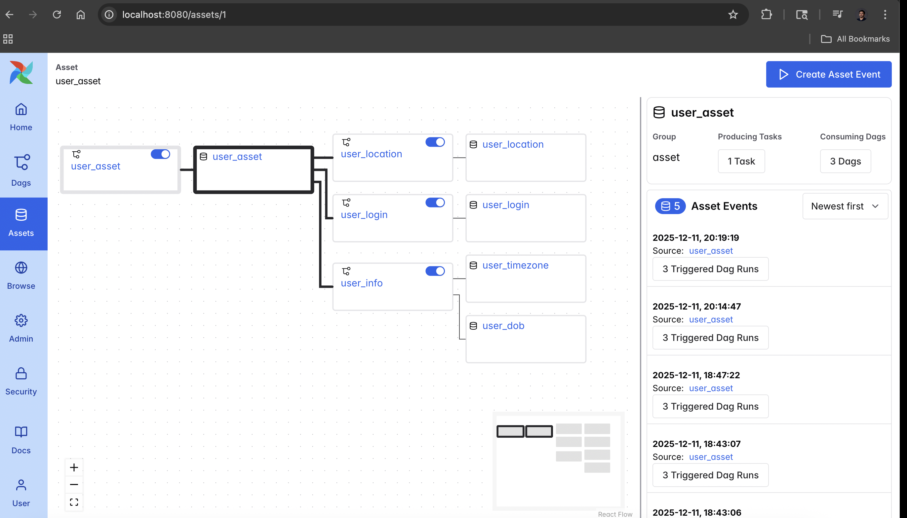

# Data-Aware Scheduling with Airflow Assets

This project explores the **Event-Driven** capabilities of Apache Airflow 3.0. Instead of running DAGs on a fixed time schedule (e.g., "every hour"), this project uses **Airflow Assets** to trigger workflows immediately when specific data becomes available.


*(This graph visualizes how the `user_asset` triggers three downstream consumers automatically)*

## 🎯 Key Concepts Explored
* **Event-Driven Architecture:** Decoupling pipelines. Downstream DAGs don't need to know *when* the upstream ran, only that *new data is ready*.
* **@asset Decorator:** Defining Python functions as data producers and consumers natively.
* **Inter-Asset Communication:** Passing data payloads (XComs) between independent Assets using the `context` object.
* **Multi-Assets:** A single function (`user_info`) producing updates for multiple logical assets (`user_timezone`, `user_dob`) simultaneously.

## ⚙️ The Workflow Logic

The pipeline consists of one **Producer** and three **Consumers**.

### 1. The Producer: `user_asset`
* **Schedule:** `@daily` (Time-based).
* **Function:** Hits the `randomuser.me` API to fetch a fresh user profile.
* **Role:** Acts as the source of truth. When it finishes successfully, it "emits" an update event for the `user_asset` dataset.

### 2. The Consumers (Triggered by Events)
These functions do *not* have a time schedule. They are scheduled on `[user_asset]`.

* **`user_location`:**
    * **Trigger:** Runs immediately after `user_asset` updates.
    * **Action:** Pulls the full JSON payload via XCom (`include_prior_dates=True`) and extracts just the **Location** data.
* **`user_login`:**
    * **Trigger:** Runs immediately after `user_asset` updates.
    * **Action:** Extracts the **Login** credentials from the payload.
* **`user_info` (Multi-Asset):**
    * **Trigger:** Runs immediately after `user_asset` updates.
    * **Action:** Extracts both **Timezone** and **Date of Birth (DOB)**.
    * **Output:** Updates two separate assets: `user_timezone` and `user_dob`.


*(Notice how the consumers have no cron schedule, but listen for `user_asset`)*

## 💻 Code Highlight: Passing Data Between Assets
One of the trickier parts of Assets is accessing the data produced by the upstream task. I implemented this using the Task Instance (`ti`) context:

```python
# How a consumer pulls data from the producer asset
user_data = context['ti'].xcom_pull(
    dag_id=user_asset.name,
    task_ids=user_asset.name,
    key="return_value",
    include_prior_dates=True # Crucial for fetching the latest event value
)

## 🚀 How to Run This Project

### 1\. Start the Environment

Navigate to the `Assets` folder and start the containers:

```bash
cd Assets
docker compose up -d
```

### 2\. Monitor the Pipeline

1.  Open Airflow at `http://localhost:8080`.
2.  Go to the **Assets** tab to see the dependency graph (as shown in the screenshots).
3.  Go to the **DAGs** tab and unpause all 4 DAGs (`user_asset`, `user_location`, `user_login`, `user_info`).

### 3\. Trigger the Event

1.  Manually trigger the **`user_asset`** DAG.
2.  **Watch the Magic:** You do *not* need to touch the other DAGs. As soon as `user_asset` finishes, the other three will automatically start running in parallel.
