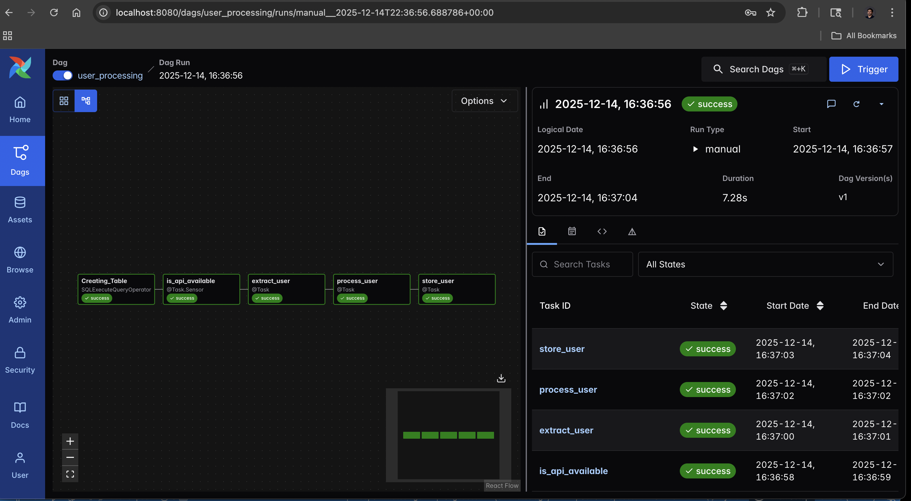

# User Processing Pipeline (ETL) with Postgres

This project implements a robust **ETL (Extract, Transform, Load)** pipeline using **Apache Airflow 3.0**. It demonstrates how to orchestrate data movement between an external HTTP API and a PostgreSQL database, handling table creation, data extraction, transformation, and loading with proper error handling and sensing.



## 🎯 Project Goals & Key Learnings
This pipeline was built to master the core concepts of Airflow 3.0, specifically:
* **TaskFlow API:** Writing cleaner, Pythonic DAGs using decorators (`@dag`, `@task`).
* **Sensors:** Using `@task.sensor` to implement "smart waiting" (polling an API) preventing pipeline failure if the source is temporarily unavailable.
* **Database Operations:** Using `SQLExecuteQueryOperator` for DDL (Data Definition Language) commands like creating tables.
* **Hooks vs. Operators:** Leveraging `PostgresHook` for high-performance tasks like bulk data loading (`COPY` command), which is more efficient than standard operators for large datasets.
* **Idempotency:** Designing tasks that can be rerun safely without creating duplicate data or errors (e.g., `IF NOT EXISTS`).

## ⚙️ Workflow Logic
The `user_processing` DAG performs the following sequential steps:

1.  **Create Table (`Creating_Table`):**
    * **Tool:** `SQLExecuteQueryOperator`
    * **Action:** Checks if the `users` table exists in Postgres; if not, creates it with the schema: `id`, `firstname`, `lastname`, `email`, `created_at`.
2.  **Check API (`is_api_available`):**
    * **Tool:** Custom Sensor (`@task.sensor`)
    * **Action:** Pings the user data API (`marclamberti/datasets`) every 30 seconds. It only allows the pipeline to proceed once a `200 OK` status is received.
3.  **Extract User (`extract_user`):**
    * **Tool:** Python Task (`@task`)
    * **Action:** Fetches the raw JSON data and parses out the specific fields we need (ID, First/Last Name, Email).
4.  **Process User (`process_user`):**
    * **Tool:** Python Task with `Pandas`
    * **Action:** Transforms the data by adding a `created_at` timestamp and saves the clean record to a CSV file (`/tmp/user_info.csv`).
5.  **Store User (`store_user`):**
    * **Tool:** `PostgresHook`
    * **Action:** Connects directly to the Postgres database and runs a bulk `COPY` command to load the CSV data into the `users` table efficiently.

## 🚀 How to Run This Project

### 1. Start the Environment
Navigate to this folder in your terminal and spin up the Airflow & Postgres containers:

```bash
cd Postgresql_Airflow
docker compose up -d
