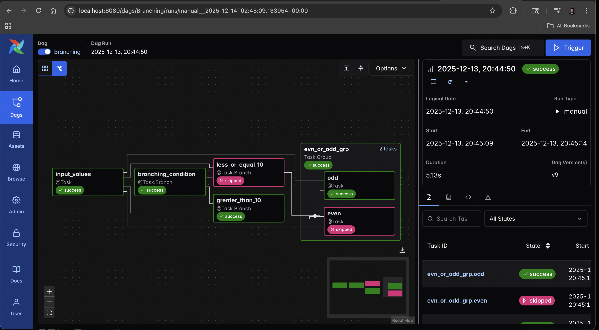

# Exploration: Conditional Logic & Branching

This module explores **Dynamic Control Flow** in Apache Airflow 3.0. Real-world pipelines are rarely linear; they often need to make decisions based on data values or user inputs.

I built this DAG to demonstrate how to implement "If/Else" logic using the `BranchPythonOperator` (`@task.branch`) and how to accept custom inputs at runtime using **Airflow Params**.


*(The graph shows the decision paths where skipped tasks turn pink and active tasks turn green)*

## 🎯 Exploration Goals
* **Runtime Inputs:** Allowing users to inject data (Values X and Y) when manually triggering the DAG.
* **Branching:** Using `@task.branch` to dynamically decide which task to run next (e.g., is the sum > 10?).
* **Trigger Rules:** Handling "Skipped" states correctly. Since only *one* path is chosen, downstream tasks must know how to handle the skipped parents without failing.
* **Task Groups:** Organizing the final outcomes (Even/Odd) into a clean UI group.

## ⚙️ The Workflow Logic
The DAG `Branching` executes a multi-step decision tree:

1.  **Input (`input_values`):**
    * Reads `X` and `Y` provided by the user at runtime.
    * Calculates the `Summation`.
2.  **Decision 1 (`branching_condition`):**
    * Checks if `Summation > 10`.
    * Routes to either `greater_than_10` or `less_or_equal_10`.
3.  **Decision 2 (Nested Branching):**
    * Both branches perform a second check: Is the number **Even** or **Odd**?
    * They route to the specific task inside the `evn_or_odd_grp` Task Group.
4.  **Final Outcome (`even` / `odd`):**
    * Prints the final result.
    * **Crucial Config:** These tasks use `trigger_rule=TriggerRule.NONE_FAILED_MIN_ONE_SUCCESS`. This ensures they run even if one of their upstream parents was "Skipped" by the branch operator.

## 💻 Code Highlight: Runtime Params & Branching
Here is how I configured the DAG to accept user input and handle the decision logic:

```python
# 1. Defining Inputs (Params)
@dag(
    params={
        "X": Param(5, type="integer", description="Enter the value of X"),
        "Y": Param(5, type="integer", description="Enter the value of Y")
    }
)

# 2. The Branching Logic
@task.branch
def branching_condition(val):
    if val["Summation"] > 10:
        return "greater_than_10"
    else:
        return "less_or_equal_10"

## 🚀 How to Run This Module

### 1\. Start the Environment

Navigate to the folder and run Docker Compose:

```bash
cd branching
docker compose up -d
```

### 2\. Trigger with Config (Runtime Input)

1.  Open Airflow at `http://localhost:8080`.
2.  Find the `Branching` DAG.
3.  **Do not just click the Play button.** Click the **Play with Options** button (often a small arrow next to Play or "Trigger DAG w/ Config").
4.  You will see a form to enter values for `X` and `Y`.
      * *Try X=10, Y=20 (Total 30 -\> \>10 -\> Even)*
      * *Try X=1, Y=2 (Total 3 -\> \<=10 -\> Odd)*
5.  Click **Trigger**.

### 3\. Verify the Graph

Go to the **Graph View**. You will clearly see the chosen path in **Green** and the skipped path in **Pink** (as shown in the screenshot above).

## 🛠 Tech Stack

  * **Orchestration:** Apache Airflow 3.0
  * **Features:** BranchPythonOperator, TaskGroups, Params, TriggerRules
  * **Language:** Python 3.12
