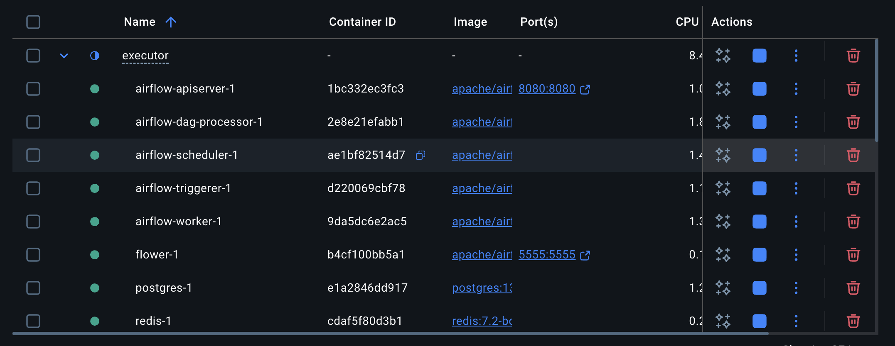
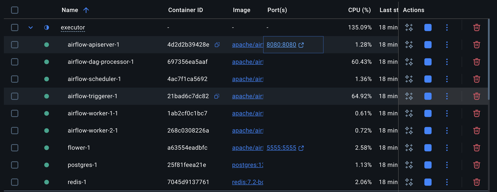
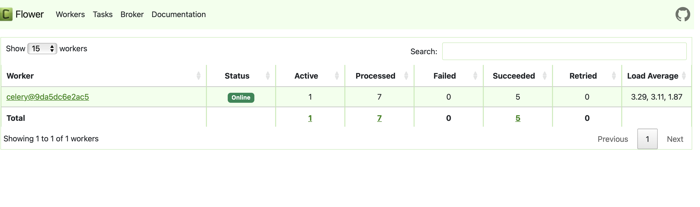
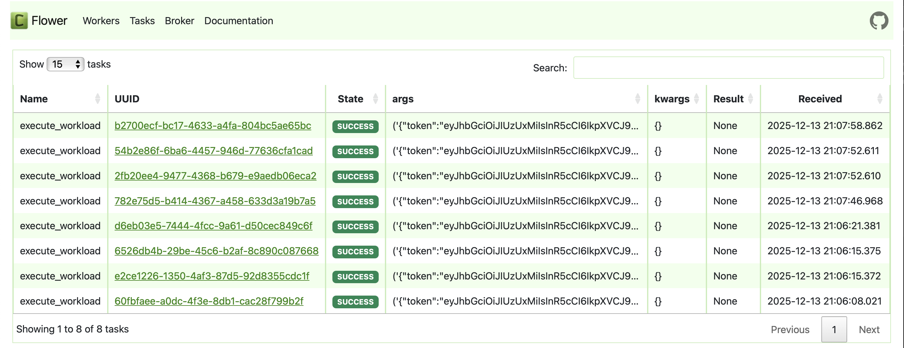
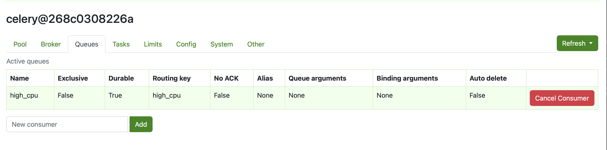
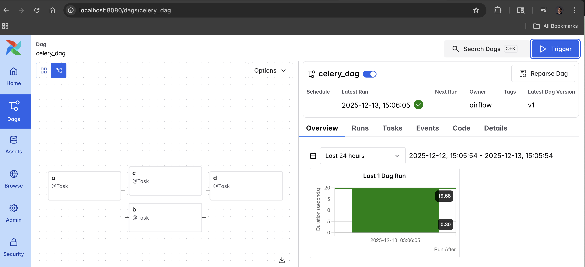

# Exploration: Scaling with Celery Executor

This module explores **Distributed Task Execution** in Apache Airflow. Moving beyond the default `SequentialExecutor` (which runs one task at a time) or `LocalExecutor`, I configured a production-grade architecture using **Celery** to distribute tasks across multiple worker nodes.

## 🎯 Exploration Goals
* **Parallelism:** Running multiple tasks simultaneously across different containers.
* **Scaling:** Adding more workers to handle increased load.
* **Monitoring:** Using **Flower** to visualize the health and status of the worker cluster.
* **Task Routing:** Using **Queues** to assign specific tasks to specific workers (e.g., isolating high-memory tasks).

## ⚙️ Architecture & Setup

### The Environment
I configured a Docker Compose environment with **Redis** as the message broker and **Postgres** as the result backend.


### Scaling Workers
Unlike a standard install, I modified the configuration to spin up **2 separate Worker Containers**. This mimics a real cluster where workers might run on different servers.

*(Note the `airflow-worker-1` and `airflow-worker-2` containers running simultaneously)*

## 🔍 Monitoring with Flower
To manage this distributed system, I integrated **Flower**, a web-based tool for monitoring Celery clusters.

**Cluster Health:**
Viewing active workers and their current load.


**Task Execution History:**
Tracking individual task success/failure rates across the cluster.


## 🚦 Advanced Concept: Queues
One of the most powerful features I explored was **Queues**. I created specific queues (e.g., `high_cpu`) to demonstrate how to route heavy tasks to specific workers, preventing them from blocking the main queue.




## ⚡ Execution Results
The DAG below was designed to test parallelism. Tasks `a`, `b`, `c`, and `d` were executed, with the Celery workers picking them up concurrently.



## 🚀 How to Run This Module

### 1. Start the Cluster
Navigate to the folder and start the distributed environment:
```bash
cd celery_executor
docker compose up -d --scale airflow-worker=2
