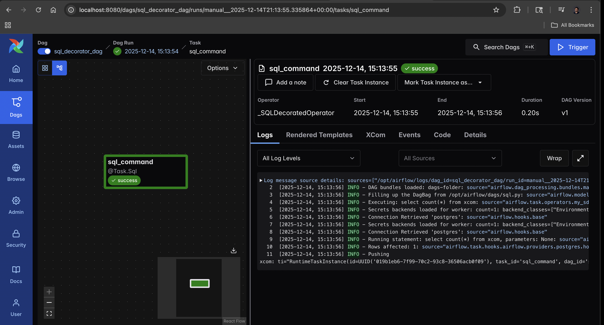

# Exploration: Building a Custom Airflow Provider (@task.sql)

This module represents my deep dive into **Extending Apache Airflow**. While most Data Engineers only *use* operators, I learned how to *build* them.

I created a custom Airflow Provider (`my-sdk`) that introduces a brand new decorator: **`@task.sql`**. This allows users to execute SQL queries simply by returning a string from a Python function, abstracting away the boilerplate of the standard `SQLExecuteQueryOperator`.



## 🎯 Exploration Goals
* **Framework Extensibility:** Understanding how Airflow finds and loads plugins via `entry_points`.
* **Custom SDKs:** Packaging custom code as a valid Python library (`my-sdk`) that triggers Airflow's Provider Manager.
* **Decorator Pattern:** creating a hybrid Operator that inherits from both `DecoratedOperator` and `SQLExecuteQueryOperator`.
* **Developer Experience (DX):** Simplifying DAG code for analysts by hiding infrastructure complexity behind a clean `@task.sql` interface.

## 🛠 Architecture: How it Works

### 1. The Custom Operator Logic
I built a class `_SQLDecoratedOperator` that bridges the gap between Python execution and SQL execution.
* **Input:** A Python function that returns a SQL string (e.g., `"SELECT count(*) FROM xcom"`).
* **Action:** The operator intercepts this string at runtime and passes it to the `SQLExecuteQueryOperator` logic to execute against the database.

### 2. The Provider Entry Point
Airflow doesn't magically know about this new code. I registered it using the standard `project.entry-points` in `pyproject.toml`.

```toml
[project.entry-points.apache_airflow_provider]
provider_info = "my_sdk:get_provider_info"
````

This tells Airflow: *"Hey, look in `my_sdk/__init__.py` to find new capabilities."*

### 3\. Docker Integration

To make this available in the Airflow environment, I modified the `Dockerfile` to install my local package in "editable" mode:

```dockerfile
COPY my-sdk /opt/airflow/my-sdk
RUN pip install -e /opt/airflow/my-sdk
```

## 💻 Usage Comparison

**Before (Standard Airflow):**
You have to instantiate a class and pass arguments manually.

```python
task = SQLExecuteQueryOperator(
    task_id="query",
    conn_id="postgres",
    sql="SELECT * FROM table"
)
```

**After (My Custom Provider):**
You just write a function. This is much more "Pythonic" and readable.

```python
@task.sql(conn_id="postgres")
def sql_command():
    return "select count(*) from xcom"
```

## 🚀 How to Run This Module

### 1\. Build and Start

Because this module involves custom Docker layers, you must build the image first:

```bash
cd creating_provider
docker compose up -d --build
```

### 2\. Verify Provider Installation

1.  Open Airflow at `http://localhost:8080`.
2.  Go to **Admin -\> Providers**.
3.  You will see **`my-sdk`** listed there\! This confirms Airflow successfully loaded your custom package.

### 3\. Run the DAG

Trigger the `sql_decorator_dag`. It will execute the SQL query against the internal Airflow database (or whichever connection you define) using your custom decorator.

## 🛠 Tech Stack

  * **Orchestration:** Apache Airflow 3.0
  * **Language:** Python 3.12
  * **Build System:** `hatchling` (via `pyproject.toml`)
  * **Concepts:** OOP, Inheritance, Decorators, Python Packaging
