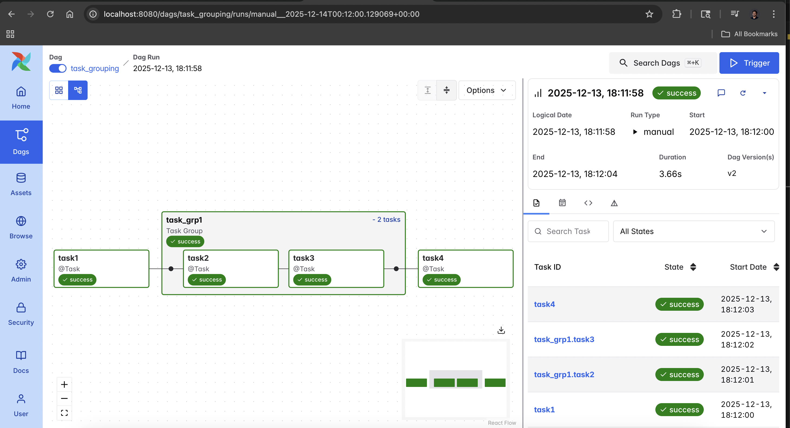
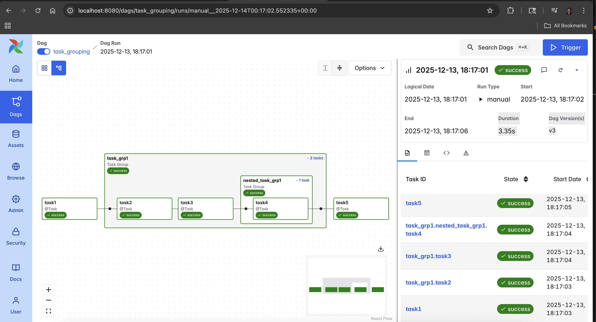
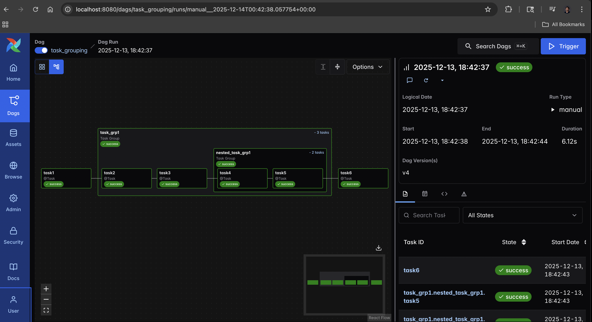
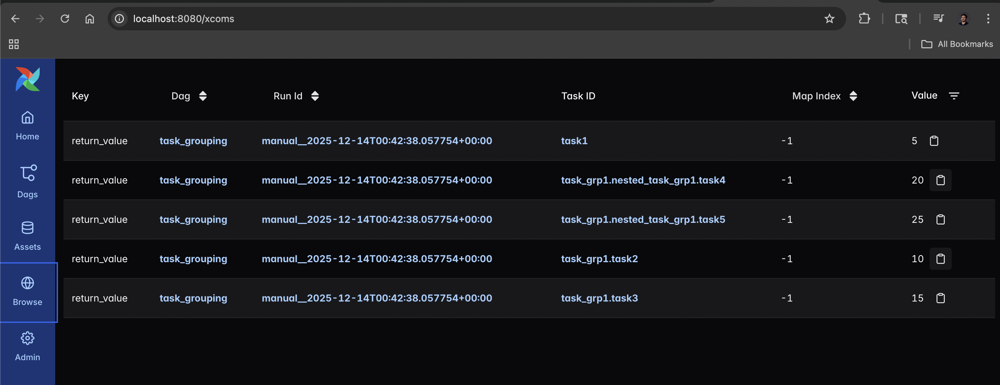
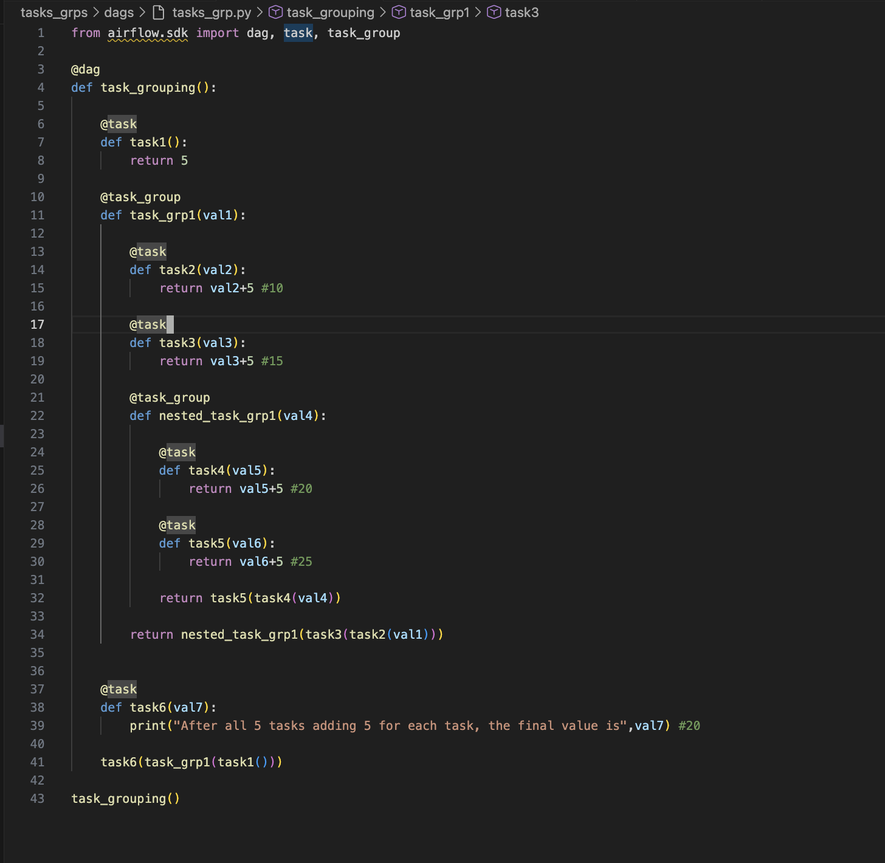

# Exploration: Task Groups & XComs

This module explores advanced DAG organization techniques in Airflow 3.0. As pipelines grow in complexity, the Airflow UI can become cluttered and difficult to debug. 

My goal was to implement **Nested Task Groups** to abstract complex logic into foldable sections, while verifying that data flows correctly between them using **XComs**.

## 🎯 Exploration Goals
* **UI Organization:** Using `@task_group` to group related tasks visually.
* **Nesting:** Creating groups *inside* other groups to handle multi-level dependencies.
* **Data Sharing:** Passing return values (XComs) seamlessly between tasks inside and outside of groups.
* **Clean Code:** Using the TaskFlow API to define dependencies implicitly (e.g., `task2(val1)`).

## ⚙️ The Workflow Logic
The DAG `task_grouping` simulates a data processing chain where each task adds `5` to the input value.

1.  **`task1`:** Returns initial value `5`.
2.  **`task_grp1`:** A parent group receiving the value.
    * **`task2`:** Adds 5 (Total: 10).
    * **`task3`:** Adds 5 (Total: 15).
    * **`nested_task_grp1`:** A child group inside the parent.
        * **`task4`:** Adds 5 (Total: 20).
        * **`task5`:** Adds 5 (Total: 25).
3.  **`task6`:** The final consumer, printing the result.

## 📸 Visualization & Results

### 1. High-Level View
Initially, the complexity is hidden. You just see the main tasks and the parent group.


### 2. Expanded (Nested) View
Expanding the groups reveals the complex dependency chain inside. Notice how `nested_task_grp1` sits inside `task_grp1`.




### 3. Data Flow Verification (XComs)
To prove the logic works, I inspected the XComs. You can see the value incrementing at each step (`5` -> `10` -> `15` -> `20` -> `25`).


## 💻 Code Structure
The implementation highlights the clean syntax of the TaskFlow API. Dependencies are defined by simply passing the function results.




```python
# The logic handles passing values down the chain automatically
task6(task_grp1(task1()))
